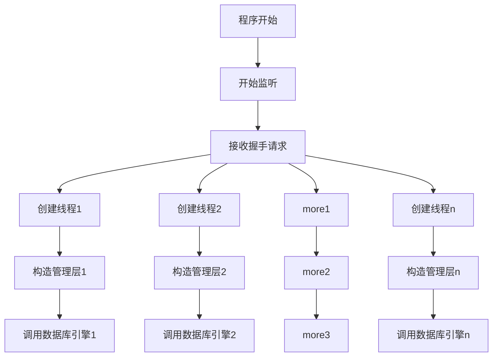
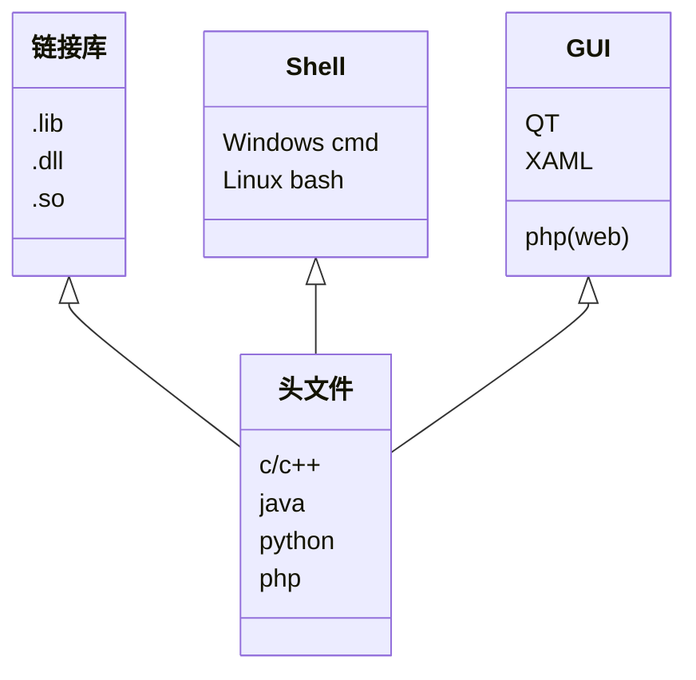

# NBUT_Best_SQL
 从零开始的SQL——数据结构大作业项目

## 项目概述
​		我们机器人学院团学的成员在收集和处理学生信息的过程中，会遇到各种各样问题和困难。例如将两张表的数据进行合并，我们会遇到表中有的列的内容是一样的，但是顺序不一样的情况，此时我们将两张表合并的过程便将变得困难。再例如我们要查询某个数据且与之相关的数据，或将表中的数据按照某个特定的顺序排列，且只输出我想要的部分时，这些操作将会变得复杂。所以我们想要做的项目是一个可以中断运行的了（数据存入硬盘不单单存入内存）的支持sql语法的数据库。

​		好的以上都是瞎扯的，做这个的原因纯粹是因为自己感兴趣，因此选为数据结构期末大作业的选题而已。

​		这个项目计划从最底层的文件读写、文件指针操作的数据库引擎（模仿InnoDB）写起，写到上层的web客户端（类似phpMyAdmin那种）。

​		老师表示：是谁给你的信心，让你觉得能在两周内把至少规划一个月的项目完成的？

​		。。。我无言以对。确实，我也觉得不可能完成，但当时我明明问过另一个老师做数据库可不可以，老师很愉快的表示当然可以，只要能体现数据结构和算法就行。于是项目就这样开始了。

​		更新这段README的时间是2020年12月30日，而答辩在29日就已经结束，很显然我没能完成。

​		但是这并没有什么关系，反正底层框架已经写得有模有样了，也能演示一些操作，用来应付15分钟的答辩是毫无压力，顺便还拿了个全班第一ヾ(•ω•`)o

​		虽然答辩已经结束了，但是这个项目我会继续做下去，应该也许大概会有同学朋友和我一起做，当然也欢迎各位提交pull request.

​		项目预计在下学期开学前完成。

## 需求分析

* 可建立多个数据表，且每个数据表中的字段（列）是可以不同数据类型的，字段的多少也是可以自定义的。
* 对每个表的的内容进行增删查和更新。
* `mysql`风格的查找。
* 可以中断运行后数据不丢失（重启程序数据不丢失）
* 优秀的读写性能。
* 可靠的稳定性。
* 待选需求:  `ui` ,权限系统,外部访问接口。

## 数据结构与算法

* b树
* sort
* 队列
* 数据库引擎
* 文件指针
* sock5通信
* XAML(待定)
* QT(待定)
* 针对机械硬盘和固态硬盘的主控优化(待定)
* Cache缓存优化
* AES-256加密

以上需求分析和数据结构与算法毫无疑问也是用来应付答辩的，真实需求分析的话没有，反正做这个只是感兴趣玩玩，建来学习的而已。

# 以下是比较正经的项目描述

## 项目功能规划

- 底层上实现SQL的基础增删查找
- 重点说一下表，要求能够创建任意字段数量、任意数据类型的、不限行数的表
- 应用层上尽量实现mySQL基本语法能实现的功能
- 设计mySQL语法风格的指令
- 权限管理系统
- 多客户端接入
- 基于socket的客户端、服务端通信
- AES-256数据加密
- Windows，Linux跨平台支持
- 多版本客户端，目前能想到的有基础shell指令客户端、.h头文件引用、dll,lib动静态链接库、GUI客户端、web客户端

## 项目构造

项目使用CMake进行配置，目前通过的编译环境有WSL Ubuntu 20-gcc和Windows 10 - MSVC14.28.29333

项目有两个target：server 和 client，服务端和客户端。两个target的源文件分别位于`Server_Src`和`Clinet_Src`，头文件一并位于`Inc`.

### 编译方法

**环境**：安装有cmake和完整c++工具链的Windows或Linux

新建一个文件夹 `build`作为项目生成目录，cd进目录，执行 `cmake ${源码路径（相对路径或者绝对路径）}`，执行 `cmake --build ./ --target ${server或cilent}`,然后项目编译就完成了。

### Server

大致上由三部分组成：服务器引擎、管理层、通信层。大致调用流程为：通信层初始化，接收到握手请求后新建一线程，构建管理层，负责解析，管理层再构建服务器引擎，进行具体的数据读写操作，去对接这一连接。

三个部分都封装成三个类，分别写在三个文件里。

### Client

客户端就比较简单，只有一个socket通信层，客户端主要目标是构建多版本的客户端。目前能想到的客户端有：

## 数据库数据结构

先写这么多，剩下的明天再更。想入门的可以看一下我的答辩PPT，里面有大致的数据结构描述（当然也只是冰山一角），也可以看看Inc里的几个头文件，我在今天都基本写好注释了。

❤的话就点个star⭐呗ヾ(•ω•`)o